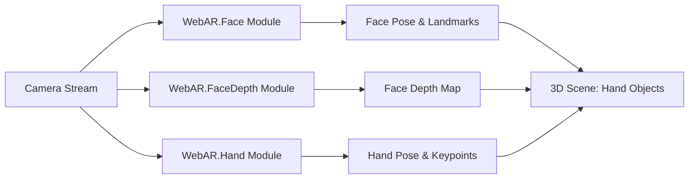

# WebAR.rocks Virtual Try-On (VTO) Technical Implementation

**Executive Summary:** WebAR.rocks provides high-performance JS/WebGL libraries for on-device hand and face tracking (WebAR.rocks.hand/face/faceDepth) enabling web-based AR try-on. These modules run entirely client-side (no backend), leveraging proprietary DL engines (2–10× faster than TensorFlow.js) to detect/track hands and faces in real time. We outline setup, API usage, and integration patterns to implement virtual try-on (VTO) features (e.g. watches, glasses, masks) on the web.

## Prerequisites

- **Browser & WebGL:** Modern browsers with WebGL2 (or WebGL1 with `OES_TEXTURE_FLOAT`/`OES_TEXTURE_HALF_FLOAT`) are required. (Check via [WebGL Report](https://webglreport.com).)  
- **HTTPS & Camera:** Must serve over HTTPS (needed for camera access). User must grant camera permission; use `onWebcamAsk`/`onWebcamGet` hooks to manage prompts. Ensure `navigator.mediaDevices` support.  
- **Device:** Any webcam-equipped desktop/mobile device. Mid-range phones are supported (mobile-friendly). Consider device capabilities (lighting, CPU/GPU speed); performance scales with hardware (engine adaptive to fps).  

## Installation & Build

- **Scripts:** Include the library scripts and models. For example, download or reference from [WebAR.rocks CDN](https://cdn.webar.rocks) or GitHub repos.  
  ```html
  <script src="dist/WebARRocksHand.js"></script>
  <script src="dist/WebARRocksFace.js"></script>
  <script src="dist/WebARRocksFaceDepth.js"></script>
  ```
- **Neural Net Models:** Place JSON model files under `neuralNets/`. For face, e.g. `NN_FACE_0.json`; for hand, a set of NNs paths; for faceDepth, `NN_FACEDEPTH_TRACK.json` and `NN_FACEDEPTH_DEPTH.json`. Load models after camera access to avoid wasted download. (You may preload them into cache on page load to speed up initialization.)
- **Build Tools:** A simple static server suffices. For modular development (NPM/ES6), clone the repo and install packages; import the `.module.js` scripts. Integration demos exist for React/Three Fiber (see each repo’s `/reactThreeFiberDemos`).  
- **Sample Setup:** A minimal project might include:
  ```
  /project
    index.html       # includes canvas and script tags
    main.js          # initializes WebAR libraries (imports if module-based)
    neuralNets/      # JSON model files
    package.json     # with "three" or other deps if needed
  ```
  For example, `index.html`:
  ```html
  <!DOCTYPE html>
  <html><head>
    <script src="dist/WebARRocksFace.js"></script>
    <script src="dist/WebARRocksFaceDepth.js"></script>
    <script src="dist/WebARRocksHand.js"></script>
    <script src="main.js" type="module"></script>
  </head><body>
    <canvas id="arCanvas" width="640" height="480"></canvas>
  </body></html>
  ```  
  And `main.js` could import these (or use global APIs) and kick off detection (see next sections).  

## Usage: API Initialization & Options

### Hand Tracking (WebAR.rocks.hand)

Include the script and add a `<canvas>` element. Then call `WEBARROCKSHAND.init()`:
```js
WEBARROCKSHAND.init({
  canvasId: 'handCanvas',
  NNsPaths: ['neuralNets/NN_HAND_0.json', /* other models */],
  callbackReady: function(errCode, spec) {
    if (errCode) { console.error('Hand init error', errCode); return; }
    console.log('WebAR Hand ready');
    // spec.GL (WebGL context), spec.canvasElement, spec.videoTexture available.
  },
  callbackTrack: function(state) {
    // Called each frame with 'state':
    // { detected:bool, isDetected:bool, // ...
    //   x, y, z (hand position), 
    //   keypoints: [...], wrist/hand orientation, etc. }
    // Use state to place 3D objects in scene.
  },
  // Optional args:
  animateDelay: 1,               // delay between detection loops (ms)
  onWebcamAsk: () => { ... },    // before asking camera
  onWebcamGet: (video) => { ... }, // after camera granted (video element)
  videoSettings: { facingMode:'user', idealWidth:640, idealHeight:480 }
});
```
- **Options:** `NNsPaths` (array of model URLs). Use `animateDelay` to tune CPU (bigger delay = lower FPS). Use `videoSettings` to control camera (front/back mode, resolution). Hand library auto-resizes the `<canvas>` for WebGL; call `WEBARROCKSHAND.resize()` if you change the canvas size.  
- **Output:** In `callbackTrack`, `state` includes hand keypoints and side (palm/back). Use these for VTO overlays (e.g. align a watch model with the wrist point).  
- **Errors:** See error codes (no explicit list in README, but `errCode` indicates failures). Check `console.log` in callbackReady.

### Face Tracking (WebAR.rocks.face)

After including `WebARRocksFace.js`, add a canvas (`id="faceCanvas"`). Initialize with `WEBARROCKSFACE.init()`:
```js
WEBARROCKSFACE.init({
  canvasId: 'faceCanvas',
  NNCPath: 'neuralNets/NN_FACE_0.json',
  callbackReady: function(errCode, spec) {
    if (errCode) { console.error('Face init error', errCode); return; }
    console.log('WebAR Face ready');
    // spec.GL, spec.videoTexture, spec.canvasElement available.
  },
  callbackTrack: function(detectState) {
    // Called each frame with face state: { isDetected, x, y, rx, ry, rz, landmarks: [...], ... }
    // DetectState.landmarks is array of [x,y] coords ([-1..1]) for each facial landmark.
    // Use detectState to position AR content (glasses, hats) relative to the face.
  },
  // Optional:
  maxFacesDetected: 2,         // up to 8 faces
  animateDelay: 2,
  onWebcamAsk: () => { ... },
  onWebcamGet: (video) => { ... },
  videoSettings: { facingMode:'user', idealWidth:640, idealHeight:480 }
});
```
- **Options:** `NNCPath` is the face model. `maxFacesDetected` enables multi-face (1–8). See optional args for webcam handling and `animateDelay`.  
- **Helpers:** Use provided `/helpers/WebARRocksResizer.js` to auto-size canvas to video, and landmark stabilizers if needed.  
- **Output:** In `callbackTrack`, `detectState` contains `isDetected`, Euler angles `rx,ry,rz`, and an array of facial `landmarks` coordinates. Also see `landmarksLabels` (labels for points) if needed.  
- **Errors:** `callbackReady(errCode)` can return codes: e.g. `"GL_INCOMPATIBLE"` (no WebGL), `"WEBCAM_UNAVAILABLE"`, etc. Handle/ log them accordingly.

### Face Depth (WebAR.rocks.faceDepth)

To insert the user’s 3D face, include `WebARRocksFaceDepth.js` and init:
```js
WEBARROCKSFACEDEPTH.init({
  canvasId: 'faceDepthCanvas',
  NNTrack: 'neuralNets/NN_FACEDEPTH_TRACK.json',
  NNDepth: 'neuralNets/NN_FACEDEPTH_DEPTH.json',
  callbackReady: function(errCode, spec) {
    if (errCode) { console.error('FaceDepth init error', errCode); return; }
    console.log('WebAR FaceDepth ready');
    // spec.GL, videoTexture, etc.
  },
  callbackTrack: function(state) {
    // state: { detected, isDetected, x, y, s, rx, ry, rz, RGBDBuf, RGBDRes, ... }
    // `RGBDBuf` is Uint8Array depth data.
    // Use `s, x, y, rx, ry, rz` to place a 3D face mesh; use RGBD data for occlusion or 3D head geometry.
  },
  // Optional:
  animateDelay: 1,
  onWebcamAsk: () => { ... },
  onWebcamGet: (video) => { ... },
  videoSettings: { facingMode:'user', idealWidth:640, idealHeight:480 }
});
```
- **Options:** Similar to face. Note the two model parameters: `NNTrack` for detection/tracking model, `NNDepth` for depth inference model.  
- **Output:** `callbackTrack` yields position (`x,y,s`) and orientation (`rx,ry,rz`) of face, plus `RGBDBuf` buffer and resolution for depth. Use these to render the live face (e.g. as a Three.js 3D object) or for occluding AR elements behind the face.  
- **Errors:** Same codes as face (`"GL_INCOMPATIBLE"`, etc). Ensure WebGL compatibility.

### VTOWatch Integration

The VTOWatch demo uses WebAR.rocks.hand to place a virtual watch on the user’s wrist. You implement it by initializing **WebARRocksHand** (as above) and in `callbackTrack`, detect relevant hand keypoints (e.g. wrist or ring-base) to anchor a 3D watch model. For example:
```js
WEBARROCKSHAND.init({
  /* ... */,
  callbackTrack: function(state) {
    if (state.isDetected) {
      const wrist = state.keypoints[0]; // assume index 0 is wrist
      // Position 3D watch model at (wrist.x, wrist.y)
    }
  }
});
```
VTOWatch’s sample uses Three.js to render the watch in real time (see [WebAR.rocks VTOWatch demo](https://github.com/WebAR-rocks/VTOWatch)). The key pattern is *hand landmarks → attach 3D asset to landmark*.  

## Integration Patterns

- **Face + FaceDepth:** Use face tracking for landmarks/pose and faceDepth for depth. For realistic AR occlusion, place 3D content (e.g. glasses) using face pose and use depth map to hide parts behind the face. Example flow (see diagram below): 
  ```
  Camera → (WebAR.FaceDepth) → Pose+Depth 
         → use in 3D scene for head insertion
  Camera → (WebAR.Face) → Landmarks+Rotation
         → use for accessory alignment.
  ```
- **Hand + Face:** Combine for gesture-controlled filters. E.g. track face to place a hat, and use hand gestures (fingers or open/close) to change objects or trigger effects (next/prev). Both modules can run concurrently on the same camera stream.  
- **Multiple Modules:** You may initialize face and hand modules in parallel (each with its own canvas or using the same video input). Share the media stream if needed (set `videoSettings.videoElement`). Use their respective `callbackTrack` to synchronize AR content.  
- **VTOWatch (Hand → Accessory):** A specific pattern: detect a ring or wrist position via hand landmarks, then render a watch/bracelet model at that point in the 3D scene, updating as the hand moves.



## Project Structure & Example

**Example Files:**

- `package.json` (if using npm):  
  ```json
  {
    "name": "webar-vto-sample",
    "version": "1.0.0",
    "dependencies": {
      "three": "^0.150.0"  // for 3D rendering
    }
  }
  ```
- `index.html`:  
  ```html
  <!DOCTYPE html><html>
  <head>
    <meta charset="UTF-8">
    <title>WebAR VTO Sample</title>
    <!-- Include WebAR.rocks scripts -->
    <script src="dist/WebARRocksFace.js"></script>
    <script src="dist/WebARRocksFaceDepth.js"></script>
    <script src="dist/WebARRocksHand.js"></script>
    <!-- (Optional) Three.js for rendering -->
    <script src="https://cdn.jsdelivr.net/npm/three@0.150.0/build/three.min.js"></script>
  </head>
  <body>
    <!-- Canvases for AR modules -->
    <canvas id="faceCanvas" width="640" height="480"></canvas>
    <canvas id="depthCanvas" width="640" height="480"></canvas>
    <canvas id="handCanvas" width="640" height="480"></canvas>
    <!-- Main logic -->
    <script src="main.js"></script>
  </body>
  </html>
  ```
- `main.js`: (Example initialization)  
  ```js
  // Face Tracking
  WEBARROCKSFACE.init({ 
    canvasId: 'faceCanvas', NNCPath: 'neuralNets/NN_FACE_0.json',
    callbackReady: (err, spec) => { /*...*/ },
    callbackTrack: state => { /* use state.landmarks[] */ }
  });
  // Face Depth
  WEBARROCKSFACEDEPTH.init({
    canvasId: 'depthCanvas', 
    NNTrack: 'neuralNets/NN_FACEDEPTH_TRACK.json', 
    NNDepth: 'neuralNets/NN_FACEDEPTH_DEPTH.json',
    callbackReady: (err, spec) => { /*...*/ },
    callbackTrack: state => { /* use state.RGBDBuf, state.rx, etc. */ }
  });
  // Hand Tracking
  WEBARROCKSHAND.init({
    canvasId: 'handCanvas',
    NNsPaths: ['neuralNets/NN_HAND.json'],
    callbackReady: (err, spec) => { /*...*/ },
    callbackTrack: state => { /* use state.keypoints */ }
  });
  ```
This structure runs all modules side-by-side. You may combine canvases or share contexts if needed. Ensure each `<canvas>` has its own ID and dimensions.

## Deployment Notes

- **HTTPS & CORS:** Serve over HTTPS. Host neural net JSON files alongside the site or on a server with CORS enabled. (Browsers block camera without HTTPS.)  
- **Hosting:** Any static file host (GitHub Pages, Netlify, S3) works. Ensure `Content-Type: application/json` for `.json` models.  
- **Performance:** For mobile, test in device mode. Optimize by using `animateDelay` and lower `videoSettings` resolution if lagging. Call `WEBARROCKS*.resize()` on canvas resize (e.g., on orientation change).  
- **Camera Permissions:** Using `onWebcamAsk/get`, show UI feedback when awaiting permission. Stop tracking if `WEBCAM_UNAVAILABLE` error is returned (no camera or denied).  

## Testing & Debugging

- **Logging:** In each `callbackReady`, log any error codes. In `callbackTrack`, log state to verify coordinates. Use console errors for missing models or permissions.  
- **Emulation:** Chrome DevTools’ Mobile Emulation (camera simulation) and [WebXR emulator] can help test without actual device.  
- **Metrics:** Use simple timers to measure loop FPS. The libraries’ `callbackTrack` is called per frame; drop or pause it via `animateDelay` if needed.  
- **Issue Diagnosis:** Check WebGL support with [webglreport.com](https://webglreport.com). If `GL_INCOMPATIBLE` appears, refer to docs. If camera fails, ensure no other tab/app uses it (see troubleshooting tips).  

## Security & Privacy

- **User Consent:** The app must explicitly request camera access; ensure a clear prompt and fallbacks if denied. Handle `PROMISEREJECTED` gracefully (show an error message).  
- **Data Handling:** All video processing is on-device; no camera data is sent to servers. Still, follow best practices (e.g. do not log raw video). Use Secure Context to avoid leaks.  
- **Privacy:** Inform users you use the camera only for AR; no biometric info is stored or transmitted. Clean up streams (`videoElement.srcObject = null`) when done.  

## Recommendations & Sources

- **3D Rendering:** Three.js is commonly used for rendering AR objects (WebAR.rocks demos use Three.js). Use coordinate transforms to map WebAR output into Three.js space.  
- **Helpers:** Utilize provided helpers (`WebARRocksResizer.js`, landmark stabilizers) from each repo’s `/helpers`. These simplify canvas resizing and smoothing.  
- **Polyfills:** Generally not needed for modern browsers. Ensure `requestAnimationFrame` and `URL.createObjectURL` are available (they usually are).  
- **Priority Sources:** Refer to each repository’s README and source for details (hand, face, faceDepth). GitHub issues may note platform-specific quirks (e.g. iOS Safari limitations). The official [WebAR.rocks documentation](https://webar.rocks/) and demo code provide additional examples.

## Feature Comparison

| Module                | Detection         | Output                            | Multi-Target       | Key Strengths                     | Limitations                              |
|-----------------------|-------------------|-----------------------------------|--------------------|-----------------------------------|------------------------------------------|
| **WebAR.rocks.hand**  | Hand in view (palm/back) | 3D keypoints (wrist, fingers), side | Single hand only   | Fast hand gestures, object VTO (ring/watch) | Fails if hand not fully in view; background clutter can confuse tracking. |
| **WebAR.rocks.face**  | Face bounding box & pose (landmarks) | 3D face rotation, position, many landmarks | Up to 8 faces (set by `maxFacesDetected`) | AR face filters (masks, glasses, makeup); robust in varied lighting | Requires clear frontal view; high CPU for >1 face; cannot infer depth. |
| **WebAR.rocks.faceDepth** | Face detection + depth inference | Face pose + depth map (RGBD buffer) | Single face only | Real-time 3D face insertion; enables occlusion and 3D mesh generation | Heavier models; lower resolution depth (buffer), limited to one face. |
| **VTOWatch (demo)**   | Wrist/hand area    | 3D watch anchor point from hand landmarks | –                  | Example for virtual watch/bracelet placement using hand tracking | Demo code only, not a separate library. |

Each module is *framework-agnostic* (no 3D engine bundled). Integrate outputs into your preferred 3D scene (e.g. positioning a Three.js mesh using the provided pose and landmark data).

**Sources:** Official WebAR.rocks GitHub READMEs for each module (primary documentation), and the WebAR.rocks website/blog. All code examples and options above are drawn from these references.